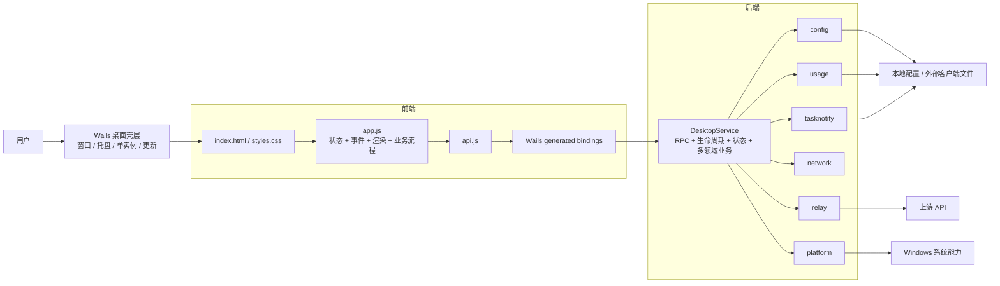
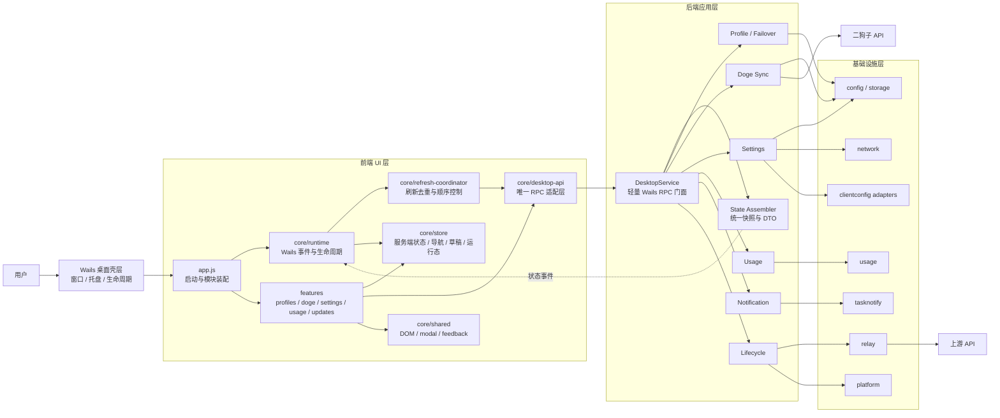

# CodexRelay 重构计划

## 1. 目标与原则

本次重构的真实问题不是“文件太长”，而是部分文件同时承担状态、业务流程、界面渲染、系统交互等多种职责。文件行数只是边界模糊的结果。

重构目标：

- 从整体架构上明确桌面壳层、前端 UI、后端应用服务和基础设施的边界。
- 前后端通过稳定的 Wails RPC 契约协作，业务代码不直接依赖生成绑定。
- 按业务能力聚合功能，让同一功能的状态、操作和渲染靠近，让不同功能尽量互不牵连。
- 采用小步、行为保持式迁移；每一步都可构建、可检查、可回退。
- 保持现有功能、配置格式、本地代理行为、外部客户端适配和用户数据兼容。

约束与非目标：

- 前后端是代码职责分离，不拆成两个进程或微服务；最终仍是一个 Wails 桌面应用。
- 不在本轮迁移 React、Vue 或新的状态管理框架，继续使用原生 ES Module。
- 不同时改造 UI、RPC 协议、持久化格式和业务规则。
- 不为了套设计模式增加空洞的接口、基类或通用框架。
- 文件大小以 100-250 行为理想，250-400 行可接受；超过 400 行应说明原因，超过 600 行优先拆分，但行数不是唯一目标。

## 2. 当前架构

当前应用已经具备运行层面的前后端分离，但源码职责仍较集中：`frontend/app.js` 混合全局状态、DOM、事件和业务流程；`internal/desktop/DesktopService` 混合 RPC、状态组装、生命周期和多个业务能力。



主要风险：

- 修改一个页面流程时，容易影响全局状态和其他页面。
- 多处直接发起刷新，可能出现重复请求、旧响应覆盖新状态等时序问题。
- Wails 生成绑定泄漏到业务模块后，前端难以独立演进。
- 后端入口层直接承载大量业务细节，依赖方向和故障边界不清晰。
- 大文件中的移动、重命名和逻辑修改混在一起，审查与回退成本较高。

## 3. 目标架构

目标是一个边界清晰的模块化单体。前端按功能组织，后端保留轻量 RPC 门面，基础设施模块不反向依赖桌面层。



依赖方向固定为：

```text
前端功能模块 -> 前端 core -> Wails RPC 门面 -> 后端应用能力 -> 基础设施 / 外部系统
```

下层不得反向依赖上层；功能模块之间优先通过共享状态或明确接口协作，不直接操作彼此的 DOM 和内部变量。

## 4. 目标目录结构

以下是近期目标，不要求一次性创建所有文件。较小功能先保持单文件，只有职责或规模确实增长时再建立子目录。

```text
frontend/
  app.js                         # 仅启动、依赖装配、模块挂载
  index.html
  styles.css
  notification.*                 # 独立提醒窗口入口
  core/
    desktop-api.js               # 唯一 Wails RPC 适配层
    runtime.js                   # 桌面事件与前端生命周期
    refresh-coordinator.js       # 状态刷新去重与顺序控制
    store.js                     # 状态域和订阅
    dom.js
    feedback.js
    modal.js
  features/
    profiles/                    # 列表、编辑、激活、排序、故障切换
    doge/                        # 账户、同步、令牌、公告、兑换
    settings/                    # 通用、连接、网络、通知、高级配置
    usage.js                     # 用量统计与明细
    updates.js                   # 检查与安装更新
  bindings/                      # Wails 生成代码，不放业务逻辑

internal/
  desktop/
    app.go                       # Wails 应用与窗口装配
    service.go                   # DesktopService 依赖与轻量门面
    state*.go                    # DesktopState / DTO 组装
    lifecycle_service.go
    profile_service.go
    profile_probe.go
    failover_*.go
    doge_*.go
    settings_service.go
    usage_service.go
    notification_service.go
    clientconfig/                # 外部客户端配置适配器
  config/                        # 配置模型、校验、持久化
  relay/                         # 本地透明代理、健康检查、运行态
  network/                       # 出站网络策略
  usage/                         # 用量采集与存储
  tasknotify/                    # 任务通知队列与投递
  platform/                      # 操作系统能力
  storage/                       # 通用文件原子写入
```

后端第一阶段只在 `internal/desktop` 包内按能力拆文件，避免过早制造跨包接口。只有某项能力的输入、输出和依赖稳定后，才评估是否独立成包。

## 5. 关键模块边界

### 前端

| 模块 | 负责 | 不负责 |
| --- | --- | --- |
| `app.js` | 创建依赖、挂载功能、启动运行时 | 页面渲染、表单校验、具体 RPC 调用 |
| `core/desktop-api.js` | 包装生成绑定、统一错误格式 | 决定 UI 展示和业务流程 |
| `core/store.js` | 保存状态、发布变更 | 调用 RPC、直接修改具体页面 DOM |
| `core/refresh-coordinator.js` | 合并重复刷新、保证新状态优先 | 页面渲染 |
| `features/*` | 某一功能的交互、校验、调用和渲染 | 读取其他功能的内部状态 |

前端状态分为四类，避免继续形成新的全局大对象：

```text
serverState  后端 GetState() 返回的只读快照
navigation   当前页面、页签、筛选条件和选中项
drafts       尚未保存的表单内容及 dirty 状态
runtime      loading、timer、modal、toast 和同步过程
```

数据流统一为：

```text
用户操作 -> feature controller -> desktop-api -> DesktopService
         -> refresh coordinator -> store -> feature render
```

### 后端

| 模块 | 负责 | 不负责 |
| --- | --- | --- |
| `DesktopService` | 暴露稳定 RPC、持有依赖、委派调用 | 堆积具体业务算法 |
| `state*.go` | 组装前端需要的状态和 DTO | 修改配置或执行网络请求 |
| `profile/failover` | Profile 生命周期、探测、激活、故障顺序 | 窗口和 DOM 行为 |
| `doge` | 账户、令牌目录、公告、同步与兑换 | 通用 Profile UI |
| `settings` | 偏好、网络、监听和客户端配置协调 | 实现底层网络传输 |
| `usage/notification/lifecycle` | 各自领域流程 | 互相读取内部实现 |
| 基础设施包 | 文件、网络、代理、系统能力 | 依赖 `internal/desktop` |

## 6. 必须保持的不变契约

重构期间以下内容默认不可改变：

- Wails 对前端暴露的方法名、参数、返回值和错误语义。
- `config.json`、`usage.json` 及活动数据目录的格式与位置规则。
- 本地代理地址、类别路由、鉴权、请求转发和故障切换行为。
- 二狗子绑定、同步、令牌导入、公告、兑换和提醒流程。
- 外部客户端配置的检测、备份、写入和跳过规则。
- 主窗口、托盘、独立提醒窗口、开机启动和应用内更新行为。
- 用户可见文案和操作路径；确需调整时，应从重构中单独立项。

## 7. 分阶段执行

| 阶段 | 工作内容 | 完成门槛 |
| --- | --- | --- |
| 0. 建立基线 | 固化功能清单、RPC 清单、关键数据流和大文件职责 | 现状与不变契约明确 |
| 1. 抽取前端 core | 先移动 API、DOM、反馈、弹窗、运行时和刷新协调代码 | 行为不变；功能模块不再直接依赖 generated bindings |
| 2. 按功能迁移前端 | 依次迁移 Profiles、Doge、Settings、Usage、Updates | 每次只迁移一个功能；`app.js` 最终只负责装配 |
| 3. 拆分前端状态 | 分离服务端快照、导航、草稿和运行态，增加订阅边界 | 不再使用混合所有职责的全局状态对象 |
| 4. 后端同包拆分 | 按 State、Profile、Doge、Settings、Usage、Notification、Lifecycle 移动代码 | RPC 契约不变；`service.go` 成为轻量门面 |
| 5. 收紧依赖 | 清理跨功能访问，确认基础设施不反向依赖 desktop | 依赖方向与目标架构一致 |
| 6. 稳定后评估 | 仅在边界稳定且收益明确时提取新包或类型化前端协议 | 没有为抽象而抽象 |

每个阶段遵守同一节奏：

1. 先移动代码并保持行为不变。
2. 再调整命名、依赖注入和局部结构。
3. 检查该阶段的构建、静态语法、导入路径和精确 diff。
4. 确认无跨阶段混改后，再进入下一阶段。

不要在一次改动中同时完成“移动代码、改变行为、重写状态和修改协议”。这会让回归原因无法定位。

## 8. 验证与完成标准

项目默认不新增或运行测试，也不做前端可视化验证；本轮已取得明确授权，因此在构建和静态检查之外，补充运行现有后端测试、前端 Playwright 交互测试及关键截图检查。

阶段性检查：

- 所有前端 JavaScript 通过语法检查，本地相对导入均可解析。
- 所有修改过的 Go 文件格式正确，`go build ./...` 通过。
- `git diff --check` 通过，无冲突标记和意外生成文件。
- 对照 RPC 清单，公开方法及签名没有意外变化。
- 对照功能清单，关键流程没有缺项；未验证项必须明确记录，不能以“代码已拆分”代替功能完整性结论。

最终完成标准：

- `app.js` 和 `DesktopService` 只承担入口与协调职责。
- 前端功能模块不直接导入 Wails 生成绑定，也不操作其他功能的内部 DOM。
- 前端四类状态有明确归属，刷新只有一个协调入口。
- 后端按业务能力聚合，基础设施包不依赖桌面层。
- 生产代码不存在无明确理由的 600 行以上文件。
- 现有功能、RPC、配置、代理和用户数据契约保持完整。
- 架构文档与实际目录一致，剩余例外均有原因和后续处理决定。

## 9. 风险与回退

- **隐式共享状态**：迁移前先列出读写点；草稿状态不能被服务端刷新覆盖。
- **异步刷新乱序**：刷新协调器必须丢弃旧响应，避免旧状态覆盖新操作结果。
- **循环依赖**：功能模块只依赖 core 和注入接口，不互相导入内部实现。
- **后端锁与生命周期**：拆文件不改变锁范围、goroutine 退出、托盘和窗口事件顺序。
- **超范围优化**：发现业务缺陷时单独记录，不夹带在纯移动阶段修复。

每一阶段应形成独立、可审查的变更。若检查失败，优先回退当前阶段，而不是继续叠加下一层重构。

## 10. 当前实施结果

截至 2026-08-30，阶段 1-5 已按本计划落地；阶段 6 的评估结论是暂不增加新的后端包或前端框架，保持当前模块化单体结构。

| 核心文件 | 重构前 | 当前 | 结果 |
| --- | ---: | ---: | --- |
| `frontend/app.js` | 约 2500 行 | 约 210 行 | 仅保留依赖装配与挂载 |
| `internal/desktop/service.go` | 约 2600 行 | 约 200 行 | 保留服务依赖、共享运行态和协调入口 |
| `internal/desktop/doge.go` | 约 1800 行 | 约 370 行 | 请求、同步、目录、通知和排序已分文件 |
| `internal/tasknotify/manager.go` | 约 940 行 | 约 310 行 | 队列、投递、迁移和 rollout 扫描已分文件 |

已完成的结构事实：

- 前端由 `core/desktop-api.js` 统一访问 generated bindings，业务模块不再直接依赖生成目录或内部兼容入口 `api.js`；该入口不作为可复用公共库 API。
- 前端状态已拆为 `serverState`、`navigation`、`drafts` 和 `runtimeState`，主窗口状态刷新由单一协调器串行处理。
- Profiles、Doge、Settings 已按功能目录聚合；Usage 和 Updates 保持单文件，避免无收益的继续拆分。
- 后端公开 RPC 仍保留在 `DesktopService`，实现按 State、Profile、Failover、Doge、Settings、Usage、Notification 和 Lifecycle 聚合。
- 基础设施包没有反向依赖 `internal/desktop`，生产源码没有超过 600 行的文件。
- 构建脚本会递归检查全部业务 JavaScript，并排除 generated bindings 与 vendor。

已执行：前端语法、相对导入、ES Module 链接、状态域属性和 DOM ID 检查，Go 格式检查、`go build ./...`、RPC 签名对比、adapter 覆盖检查、PowerShell 语法检查和 diff 卫生检查。

本轮测试与可视验证记录：

- 项目实际发布目标下，使用 `GOARCH=amd64`、`CGO_ENABLED=0` 执行 `go test -count=1 ./...`，后端全部测试通过，覆盖配置、桌面服务、客户端配置、网络、平台、Relay HTTP/代理、存储、任务通知和用量统计。
- 当前机器默认 Go 环境为 386；直接执行测试会在 Wails 初始化 Windows COM callback 时因参数宽度限制 panic。该问题发生在业务测试运行前，属于 386 运行环境限制，不是业务断言失败。
- 执行 `node test/ui-notification-smoke.cjs`，主窗口、编辑器、确认框、拖拽排序、待导入、设置页签、任务通知、网络设置、连接页、公告、令牌切换、引导页和 390px 移动视口的交互场景通过。
- 对 Playwright 产出的关键截图逐张检查，未发现空白页面、横向溢出、控件重叠或明显裁切。
